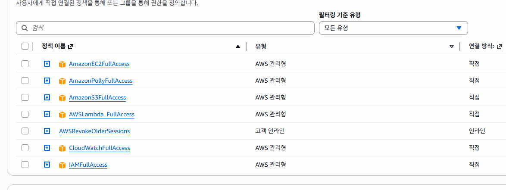
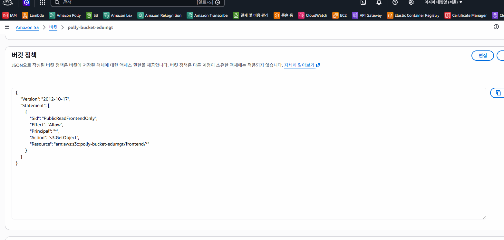
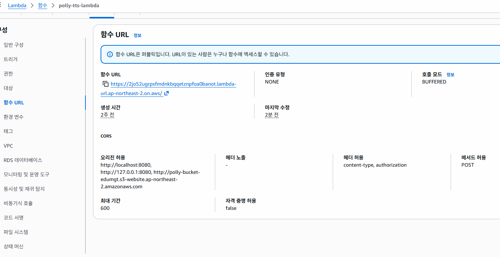

# Amazon Polly TTS 실습 레포 (AI-AWS-Polly)

## 기술 스택

### 런타임 / 언어
- **Python 3.12**: API 서버 실행 환경
- **FastAPI + Uvicorn**: REST API 서버 프레임워크
- **JavaScript (Vanilla)**: 프론트엔드

### AWS 서비스
- **Amazon Polly**: 텍스트를 음성(MP3/OGG)으로 변환
- **AWS Lambda (Function URL)**: TTS API 서버리스 실행 (선택)
- **Amazon S3**: 생성된 음성 파일 저장 및 Presigned URL 제공
- **AWS IAM**: 실행 역할/권한 및 배포 권한 관리



### SDK / 배포 도구
- **boto3**: Python용 AWS SDK (Polly, S3 호출)
- **AWS CLI**: IAM 정책 적용, Lambda 배포/업데이트, S3 CORS 설정
- **Bash 스크립트 (`infra/aws-cli-deploy-lambda.sh`)**: CLI 기반 Lambda 배포 자동화

### 웹/애플리케이션 구성
- **FastAPI 서버 (`server/`)**: Polly 합성 및 S3 저장 API (`/synthesize`, `/health`)
- **Frontend (Vanilla HTML/CSS/JS)**: Gemini 스타일 화이트 톤 UI — 텍스트 입력, 음성 생성 요청, 재생
- **Docker / Docker Compose**: 서버 + 프론트엔드 통합 실행
- **CORS 미들웨어**: `CORS_ALLOW_ORIGIN` 환경변수로 허용 Origin 제어

### 개발/실습 환경
- **Docker, Docker Compose**: 로컬 실행 (Python 설치 불필요)
- **Linux/WSL/터미널 환경**: 제공된 스크립트 및 AWS CLI 명령 실행
- **AWS 계정 및 사전 구성**: AWS CLI 로그인, S3 버킷 준비

Amazon Polly(Text-to-Speech)를 Python(boto3)으로 호출해 다음을 실습합니다.
- MP3/OGG 생성
- SSML 제어
- S3 저장 및 Presigned URL 재생
- **FastAPI + Frontend 기반 텍스트→MP3 저장/재생 모듈**

## 프로젝트 구조
```
AI-AWS-Polly/
  server/                     # Python FastAPI API 서버
    main.py                   #   /synthesize, /health 엔드포인트
    requirements.txt          #   fastapi, uvicorn, boto3, pydantic
    Dockerfile
  lambda/                     # AWS Lambda 핸들러 (Python 3.12, 선택적 배포)
    handler.py                #   lambda_handler 진입점 (boto3로 Polly·S3 처리)
  frontend/                   # 브라우저 UI (Gemini 스타일 화이트 톤)
    index.html
    styles.css
    app.js
    Dockerfile
  infra/aws-cli-deploy-lambda.sh
  docker-compose.yml          # server + frontend 통합 실행
  .env.example                # 환경변수 예시
```

## 1) Docker 기반 실행 (권장)

Python 설치 없이 Docker만으로 서버와 프론트엔드를 실행할 수 있습니다.

### 사전 요구사항
- Docker 및 Docker Compose 설치
- AWS 자격증명 (Access Key / Secret Key)
- S3 버킷 1개

### 실행 방법

1. `.env.example`을 복사해 `.env` 파일을 생성한 후 AWS 정보를 입력합니다.
   ```bash
   cp .env.example .env
   ```
   `.env` 파일 내용 예시:
   ```
   AWS_REGION=ap-northeast-2
   AWS_ACCESS_KEY_ID=xxxx
   AWS_SECRET_ACCESS_KEY=xxxx
   POLLY_S3_BUCKET=your-unique-bucket-name
   POLLY_S3_PREFIX=polly-lab/
   CORS_ALLOW_ORIGIN=http://localhost:8080
   ```

2. Docker Compose로 빌드 및 실행합니다.
   ```bash
   docker compose up --build
   ```
   - FastAPI 서버: http://localhost:3001
   - Frontend: http://localhost:8080

3. 브라우저에서 http://localhost:8080 접속 후 좌측 사이드바의 API URL 입력란에 `http://localhost:3001` 을 입력하면 로컬 서버를 통해 TTS를 사용할 수 있습니다.

### 종료
```bash
docker compose down
```

---

## 2) API 엔드포인트

| Method | Path | 설명 |
|--------|------|------|
| GET | `/health` | 서버 상태 확인 |
| POST | `/synthesize` | 텍스트→음성 합성 후 S3 저장 및 Presigned URL 반환 |

### POST `/synthesize` 요청 예시
```json
{
  "text": "안녕하세요. AWS Polly 실습입니다.",
  "textType": "text",
  "voiceId": "Seoyeon",
  "engine": "neural",
  "format": "mp3"
}
```

### 응답 예시
```json
{
  "savedToS3": true,
  "s3Bucket": "your-bucket",
  "s3Key": "polly-lab/1234567890-Seoyeon.mp3",
  "contentType": "audio/mpeg",
  "engine": "neural",
  "audioUrl": "https://...(presigned url)...",
  "expiresIn": 3600
}
```

---

## 3) Lambda 배포 (AWS CLI, 선택)

`lambda/handler.py` (Python 3.12)를 AWS Lambda에 직접 배포합니다.
boto3는 Lambda 런타임에 내장되어 있으므로 별도 패키지 설치가 필요 없습니다.

| 항목 | 값 |
|------|-----|
| 런타임 | `python3.12` |
| 핸들러 | `handler.lambda_handler` |
| 패키징 | `handler.py` 단일 파일 zip |

### 사전 요구사항
- AWS CLI 로그인 완료
- `zip` 유틸리티

```bash
sudo apt-get update && sudo apt-get install -y zip unzip
```

IAM 배포 권한 부여:
```bash
aws iam put-user-policy \
  --user-name devtest2 \
  --policy-name polly-tts-lambda-deploy \
  --policy-document file://json/polly-lambda-deploy.json
```


환경변수 설정 후 배포 스크립트 실행:
```bash
export AWS_REGION=ap-northeast-2
export LAMBDA_NAME=polly-tts-lambda
export ROLE_NAME=polly-tts-lambda-role
export POLLY_S3_BUCKET=edumgt-20260402-14-test
export CORS_ALLOW_ORIGIN='*'

sudo ./infra/aws-cli-deploy-lambda.sh
```

> **주의**: `POLLY_S3_BUCKET` 버킷명은 전 세계 고유한 이름을 사용하세요.
> 스크립트는 버킷명이 이미 사용 중이면 새 고유 버킷명으로 자동 전환하고, 그 이름에 맞춰 Lambda IAM 정책도 다시 구성합니다.

#### 배포 충돌 오류 발생 시
```
An error occurred (ResourceConflictException) when calling the UpdateFunctionConfiguration operation: ...
```
```bash
aws lambda wait function-updated --function-name polly-tts-lambda
aws lambda wait function-updated-v2 --function-name polly-tts-lambda  # v2 가능 시
```

배포 성공 확인:
```bash
aws lambda get-function-configuration \
  --function-name polly-tts-lambda \
  --query '{LastUpdateStatus:LastUpdateStatus,Reason:LastUpdateStatusReason}' \
  --output table
```
```
--------------------------------
|   GetFunctionConfiguration   |
+-------------------+----------+
| LastUpdateStatus  | Reason   |
+-------------------+----------+
|  Successful       |  None    |
+-------------------+----------+
```

배포가 끝나면 Function URL이 출력됩니다.

```
[8/8] Done

완료:
 - Function URL: https://xxxx.lambda-url.ap-northeast-2.on.aws/
 - S3 Bucket   : edumgt-20260402-14-test
 - S3 Prefix   : polly-lab/
```

Lambda Function URL 엔드포인트:
- `GET /health`
- `GET /engines`
- `POST /synthesize`
- `POST /` (동일 동작)


---

## 4) Frontend 사용 방법

브라우저에서 http://localhost:8080 접속 후:

1. 좌측 사이드바 **API URL** 입력란에 서버 주소 입력
   - Docker 로컬 실행: `http://localhost:3001`
   - Lambda 배포: `https://xxxx.lambda-url.ap-northeast-2.on.aws`
   - 프론트엔드는 내부적으로 `/engines`, `/synthesize` 경로를 붙여 호출합니다.
2. **Voice** 칩에서 음성 선택 (Seoyeon, Jihye, Matthew 등)
3. **Engine** 칩에서 엔진 선택 (neural, standard, generative, long-form)
4. 하단 입력창에 텍스트 입력 후 **전송 버튼** 클릭 (또는 Enter)
5. MP3가 S3에 저장되고 채팅 카드에 오디오 플레이어가 표시됩니다
6. 카드 하단 버튼으로 **URL 복사** 또는 **다운로드** 가능

---

## 5) CORS 오류 발생 시 (Lambda 사용 시)

CORS preflight 확인:
```bash
curl -i -X OPTIONS "https://xxxx.lambda-url.ap-northeast-2.on.aws/" \
  -H "Origin: http://localhost:8080" \
  -H "Access-Control-Request-Method: POST" \
  -H "Access-Control-Request-Headers: content-type,authorization"
```

헬스체크:
```bash
curl "https://xxxx.lambda-url.ap-northeast-2.on.aws/health"
```

Lambda CORS 설정 업데이트:
```bash
aws lambda update-function-url-config \
  --function-name polly-tts-lambda \
  --auth-type NONE \
  --cors '{
    "AllowOrigins":["http://localhost:8080"],
    "AllowMethods":["GET","POST","OPTIONS"],
    "AllowHeaders":["content-type"],
    "ExposeHeaders":["content-type"],
    "MaxAge":86400
  }'
```

403 오류 시 Lambda 퍼블릭 호출 권한 부여:
```bash
aws lambda add-permission \
  --function-name polly-tts-lambda \
  --statement-id UrlPolicyInvokeFunctionPublic \
  --action lambda:InvokeFunction \
  --principal "*" \
  --invoked-via-function-url
```






Lambda 재배포 시 CORS Origin 지정:
```bash
AWS_REGION=ap-northeast-2 \
LAMBDA_NAME=polly-tts-lambda \
ROLE_NAME=polly-tts-lambda-role \
POLLY_S3_BUCKET=edumgt-20260402-14-test \
CORS_ALLOW_ORIGIN='http://localhost:8080' \
sudo ./infra/aws-cli-deploy-lambda.sh
```

> **참고**: `RUNTIME` / `HANDLER` 환경변수로 오버라이드 가능합니다.
> 기본값은 `python3.12` / `handler.lambda_handler`입니다.

### 한국어 지원 Voice ID 조회
```bash
aws polly describe-voices \
  --region ap-northeast-2 \
  --language-code ko-KR \
  --query "Voices[].Id" \
  --output text
```

---

## 6) 운영 관점 기술 상세

### 6-1. 오디오 파일 수명주기 (S3 Lifecycle)
- TTS 결과물을 임시 파일로 다루는 경우 **자동 만료 정책**이 중요합니다.
- 권장: `polly-lab/` prefix 객체는 1일 또는 1시간 기준으로 자동 삭제.
- 1시간 단위 만료는 S3 Lifecycle의 최소 해상도(일 단위) 한계가 있으므로, 아래 중 하나를 사용합니다.
  1. S3 Lifecycle(1일) + 짧은 Presigned URL 만료(예: 10분)
  2. EventBridge Scheduler + Lambda 정리 잡(생성 시각 기준 1시간 경과 객체 삭제)
  3. 업로드 시 `expiresAt` 메타데이터 기록 후 배치 삭제

### 6-2. Frontend 정적 호스팅 (S3 + CloudFront)
- `frontend/` 산출물을 S3 버킷에 업로드 후 CloudFront 배포를 연결하면 정적 웹 주소로 서비스할 수 있습니다.
- 운영 권장 구성
  - S3 버킷: private + OAC(Origin Access Control)
  - CloudFront: HTTPS 강제, 압축(br/gzip), 캐시 정책 분리(`index.html` 짧게, 정적 자산 길게)
  - Route53: 커스텀 도메인 연결

### 6-3. 배포 자동화 (GitHub Actions)
- 수동 배포 스크립트(`infra/aws-cli-deploy-lambda.sh`)를 기반으로 CI/CD를 구성할 수 있습니다.
- 예시 워크플로
  - `main` push 시: Lambda 패키징/배포 + Frontend S3 sync + CloudFront invalidation
  - Secret: `AWS_ACCESS_KEY_ID`, `AWS_SECRET_ACCESS_KEY`, `AWS_REGION`, `POLLY_S3_BUCKET`

### 6-4. 다국어 혼합 음성 처리
- Polly는 단일 Voice에서도 `SSML <lang>` 태그를 통해 부분 언어 전환이 가능합니다.
- 실무 권장 전략
  1. 텍스트 언어 구간 분리(ko/en/ja 토큰화)
  2. 구간별 최적 Voice 매핑
  3. 숫자/약어/고유명사 정규화(발음 사전 규칙)
  4. 긴 문장은 문장 단위 합성 후 오디오 결합

### 6-5. 운영 안정성
- 재시도 정책: Polly/S3 실패 시 exponential backoff + jitter.
- 관측성: CloudWatch Logs에 requestId, voiceId, engine, latency(ms), s3Key 기록.
- 비용 관리: 문자 수 기반 비용 모니터링(일별/서비스별 태깅).
- 보안: 공개 URL 최소화, presigned URL 만료 짧게, IAM least privilege 유지.

## 참고 문서
- API: `docs/api.md`
- SSML: `docs/ssml-snippets.md`
- IAM: `docs/iam-policy.md`
- TODO(고도화 백로그): `TODO.md`
